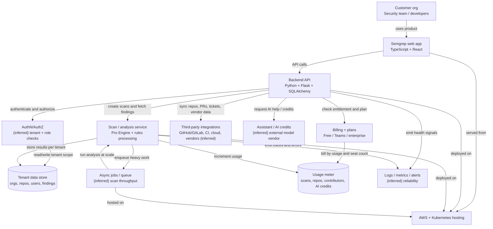
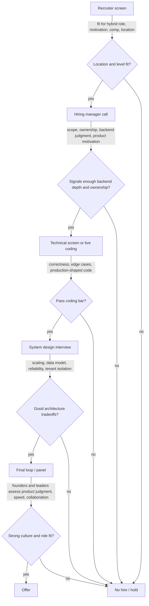

# Diagrams

## Semgrep's likely product and backend architecture, with tenant and metering boundaries

*Also written to `diagrams/architecture.mermaid`.*

## Predicted Semgrep interview process from recruiter screen to offer

*Also written to `diagrams/process.mermaid`.*
